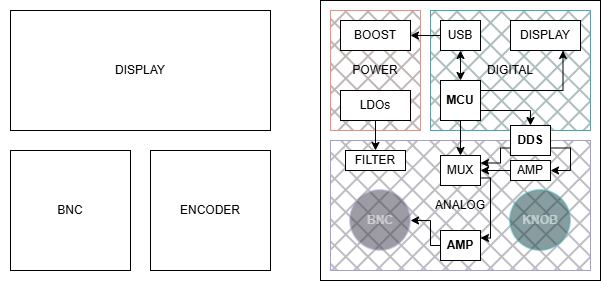

# Hardware

Hardware design for the Carrier-Wave function generator.

> 🚧 Under development

## Architecture Overview

The Carrier-Wave hardware combines DDS-based digital waveform generation with a precision analog stage and low-noise power system.

**MCU:** STM32G4  
- Controls DDS over SPI
- Generates VGA and offset voltages using DACs
- Handles user interface and system logic

**DDS:** AD9834 *(potential overclocking to ~100 MHz MCLK)*[†](#footnotes)
- Generates base waveform (sine, triangle, square)  
- Output filtered and amplified by analog stage

## Preliminary Layout

## Power System

- **Dual-rail Boost Converter (TPS65131)**  
  - Generates positive and negative rails for analog output stage 

- **±12V Dual LDO (TPS7A39)**  
  - Post-regulation for analog output rails  
  - Reduces ripple and switching noise from boost stage

- **±5V Converter/Regulator (LM27762)**
  - Supplies lower-voltage rails for pre-amplification stages
  - Integrated charge pump and LDO for compact design

## Analog Stage

- **Differential Termination & Pre-Amplification**
  - Terminates complementary DDS current outputs
  - Converts differential current to single-ended voltage
  - Cancels even-order harmonics and common-mode noise
  - Sets baseline signal amplitude before filtering

- **Reconstruction Filter (High-Order Butterworth)**
  - Removes DDS images and high-frequency components
  - Designed for flat passband and minimal ripple

- **Variable Gain Amplifier (VGA)**
  - Provides digitally controlled gain over the full amplitude range
  - Analog gain control via dedicated DAC channel

- **DC Offset Stage**
  - Adds programmable DC offset after the VGA
  - Independent of amplitude control

- **Output Amplifier**
  - Fixed gain, high-current drive stage
  - Scales signal to target voltage range (up to ±10 V)
  - Drives both high-impedance and 50Ω loads

- **Square Wave Path (Parallel)**
  - Taps SIGN BIT OUT from the DDS, a logic-level square wave phase-locked to the NCO
  - Scaled and AC-coupled to match the analog path baseline amplitude
  - Bypasses the reconstruction filter to preserve edge integrity
  - Selected via analog mux; rejoins the signal chain before the VGA

## User Interface

- OLED display
- Rotary encoder for input  
- USB-C connector 
- BNC connector

## Design Considerations

- **Noise Isolation:** Separation of digital, power, and analog sections to minimize interference
- **Signal Integrity:** Short, controlled traces and proper impedance for high-frequency paths  
- **Power Quality:** Multi-stage regulation (boost + LDOs + local decoupling) for clean analog rails
- **Thermal Management:** Adequate copper area and layout to dissipate heat from regulators, amps, or DDS

## Notes

- DDS clocking, filtering, and amplifier bandwidth will ultimately define achievable signal quality at higher frequencies.
- Analog performance will be validated through simulation and measurement during later development stages.

#### Footnotes:
- † Overclocking the AD9834 may increase power dissipation and degrade spectral performance due to internal timing violations, and is not guaranteed by the manufacturer. [ADI](https://www.analog.com/en/resources/product-faqs/ad9834.html)
